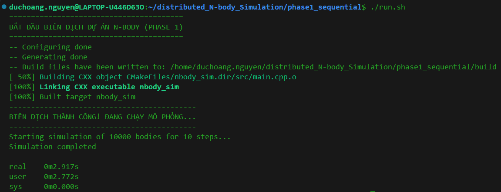
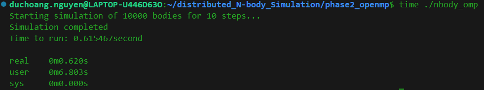
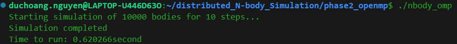

# 🌌 High-Performance N-Body Simulation Engine

<div align="center">


</div>

## 📖 Executive Summary

This project is a high-performance physics engine designed to simulate the gravitational interactions of $N$ celestial bodies in a 3D space. 

Rather than a single monolithic script, this repository is architected as an **evolutionary study in High-Performance Computing (HPC)**. It systematically addresses the computational $O(N^2)$ bottleneck of the N-Body problem by scaling from a single-threaded baseline up to a distributed network cluster and GPU-accelerated environment.

---

## 🏗️ Architectural Evolution (The 4 Phases)

The simulation is strictly versioned into four distinct architectural phases, demonstrating progressive mastery over systems engineering, memory management, and parallel computing.

### 📍 [Phase 1: Sequential Baseline](./phase1_sequential)
* **Focus:** Algorithmic correctness and mathematical foundation.
* **Core Tech:** C++17, Newton's Law of Universal Gravitation, Euler Integration.
* **Achievement:** Established a mathematically stable baseline using a `SOFTENING` constant to prevent division-by-zero singularities during close-body encounters. Applied Newton's 3rd Law to halve the computational load for the sequential run.

### ⚡ [Phase 2: Shared-Memory Parallelization](./phase2_openmp)
* **Focus:** Multi-core CPU utilization and thread synchronization.
* **Core Tech:** OpenMP, Lock-free Data Structures, Cache Optimization.
* **Achievement:** Restructured the memory access pattern to eliminate Data Race conditions without the severe overhead of mutex locks. Achieved an **8.06x linear speedup** (0.62s vs 5.0s) on 10,000 bodies utilizing dynamic thread scheduling.

### 🌐 [Phase 3: Distributed-Memory Compute (In Progress)](./phase3_mpi)
* **Focus:** Horizontal scaling, network topology, and data serialization.
* **Core Tech:** MPI (Message Passing Interface), Cluster Computing.
* **Objective:** Partition the universe domain across multiple physical servers. Overcome network latency bottlenecks using asynchronous collective communications (`MPI_Isend` / `MPI_Irecv` / `MPI_Allgather`).

### 🚀 [Phase 4: Hardware Acceleration (Planned)](./phase4_cuda)
* **Focus:** SIMT (Single Instruction, Multiple Threads) execution and Host-to-Device memory bandwidth.
* **Core Tech:** NVIDIA CUDA C++, GPU VRAM Management.
* **Objective:** Offload massive floating-point operations to the GPU. Target: Simulating **1,000,000+ bodies** in real-time by minimizing PCIe bus transfers and maximizing block/grid spatial locality.

---

## 📈 Observability & Performance Metrics

Performance is strictly benchmarked at each phase using a standard dataset of $N = 10,000$ bodies.

<div align="center">
  
  
  
  <br>
  <em>Proof of Execution: Reducing processing time from ~5.0s (Sequential) to 0.62s (Parallel).</em>
</div>

<br>

### Global Benchmark Matrix

| Architecture | Compute Domain | Optimal Dataset | Speedup vs Baseline | Status |
| :--- | :--- | :--- | :--- | :--- |
| **Phase 1 (Sequential)** | Single Core CPU | 10,000 | Baseline (1.0x) | ✅ Completed |
| **Phase 2 (OpenMP)** | Multi-Core CPU | 50,000 | **~8.0x Faster** | ✅ Completed |
| **Phase 3 (MPI)** | Multi-Node Cluster | *Pending* | *Pending* | 🚧 WIP |
| **Phase 4 (CUDA)** | GPU Cores | **> 1,000,000** | *Target: > 500x* | 📅 Planned |

---

## ⚙️ Build Instructions & Global Configuration

This repository uses a global `CMakeLists.txt` to manage all sub-projects efficiently, allowing you to compile all phases simultaneously.

### Prerequisites
* **Compiler:** GCC 9.0+ or Clang 10.0+ (Must support C++17)
* **Build System:** CMake 3.10+
* **Libraries:** OpenMP, MPICH/OpenMPI (for Phase 3)
## 📂 Project Structure
```
Distributed-N-Body-Simulation/
├── phase1_sequential/      # Baseline single-threaded implementation
├── phase2_openmp/          # Multi-threaded OpenMP optimization
├── phase3_mpi/             # Network distributed MPI implementation
├── phase4_cuda/            # GPU accelerated CUDA kernel (Planned)
├── CMakeLists.txt          # Global build configuration
└── README.md               # Executive overview (You are here)
```
### Quick Start
```bash
# 1. Clone the repository
git clone [https://github.com/HoangDuc1003/Distributed-N-Body-Simulation.git](https://github.com/HoangDuc1003/Distributed-N-Body-Simulation.git)
cd Distributed-N-Body-Simulation

# 2. Generate build files
mkdir build && cd build

# 3. Configure CMake with Release flag for maximum optimization
cmake -DCMAKE_BUILD_TYPE=Release ..

# 4. Compile all phases utilizing all available CPU cores
make -j$(nproc)
```
## 📧 Contact

- **Developer**: Hoang Duc
- **Specialization**: Backend Architecture, Systems Engineering, & High-Performance Computing
- **Email**: hhprolay@gmail.com
- **Project Link**: https://github.com/HoangDuc1003/N-Body-Simulation-HPC
