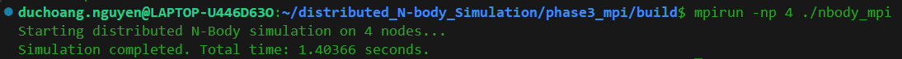

# 🌐 N-Body Simulation - Phase 3: MPI Distributed Computing
> **Scaling beyond a single machine through distributed memory architecture.**


---

## 🚀 Architectural Shift: Distributed Memory
While Phase 2 optimized compute power on a single shared-memory machine, this phase scales the simulation across a **Cluster of independent nodes**. By utilizing the Message Passing Interface (**MPI**), the universe domain is partitioned, allowing multiple physical machines to collaborate on the $O(N^2)$ gravitational problem.

> **Execution Proof for Phase 3 (4-Node Cluster):**
> <div align="center">
>   
> </div>

### 🛠 System Engineering Highlights
* **Domain Decomposition:** The dataset of $N$ bodies is evenly partitioned across all available nodes. A 4-node cluster assigns exactly $N/4$ calculations to each independent CPU.
* **Network Synchronization:** Implements `MPI_Allgather` to broadcast updated positional states across the entire cluster at the end of every time step.
* **Overhead Analysis:** Successfully isolated and measured the network communication bottleneck inherent in distributed systems.

## 📊 Performance & Latency Analysis
| Metric | Sequential (1 Core) | OpenMP (Shared RAM) | MPI (4 Nodes / Dist. RAM) |
| :--- | :--- | :--- | :--- |
| **Execution Time** | ~5.00s | **0.62s** | 1.40s |
| **Bottleneck** | Compute Bound | Highly Optimized | **Network Bound** |

### 🔍 Engineering Observation (The Amdahl's Law Effect)
For a relatively small dataset ($N = 10,000$), the **Phase 3 (MPI) execution is slower than Phase 2 (OpenMP)**. This is a classic demonstration of network latency overhead. 

In Phase 2, threads share the same physical RAM, resulting in near-instantaneous memory access. In Phase 3, after every step, nodes must serialize, transmit, and deserialize physical data packets across the network. For small $N$, the time spent transmitting data (Communication) far outweighs the time saved by dividing the calculations (Computation). This architecture is specifically designed to excel when $N$ exceeds the RAM capacity of a single machine (e.g., millions of bodies).

## 🔨 Cluster Compilation & Execution
To build and run this simulation across multiple processes (simulating cluster nodes), use the MPI wrappers:

```bash
# Compile using MPI C++ Wrapper
mpicxx -O3 src/main.cpp -o nbody_mpi

# Execute across 4 isolated nodes
mpirun -np 4 ./nbody_mpi
